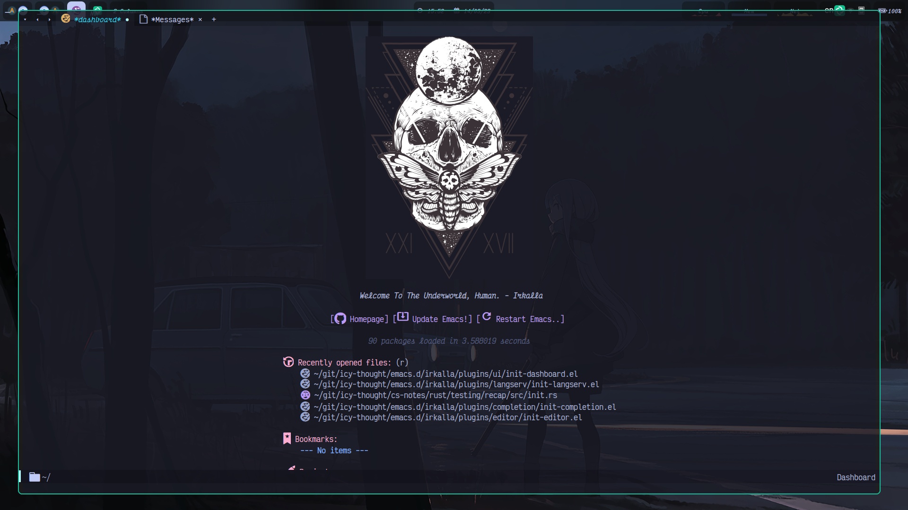

  

# (Preview) Irkalla Emacs

# Introduction 🌱

Hello and thank you for visiting my Emacs configuration repository! This repository serves as a collection of my
personal Emacs setup, tailored to enhance my workflow and suit my preferences. I've dedicated significant time and
effort to fine-tune and optimize this configuration, creating a productive and enjoyable Emacs experience.

## Getting Started 🌻

To explore my Emacs configuration, simply clone this repository to your local machine. You will find all the necessary
files, packages, and themes within the dedicated folders of each Emacs setup (`doom-config` || `irkalla`). Feel free to
review the various settings and customization options, experiment with different features, and adapt them to your own
workflow.

## Contributing 🦝

I firmly believe that collaboration and community feedback are vital for growth and improvement. Therefore, I encourage
you to test my Emacs configuration and share your thoughts, opinions, and suggestions. Your valuable insights can help
me refine and enhance this setup, making it even better for everyone!

If you encounter any issues or have ideas for improvements, please don't hesitate to create an issue on GitHub!
Additionally, if you'd like to contribute directly, you can fork this repository, make the desired changes, and submit a
pull request. I appreciate all contributions, whether it's fixing bugs, introducing new features, or suggesting
optimizations!

# Share Your Feedback! 🎇

Your feedback is crucial in shaping the direction of this Emacs configuration. I'm open to discussions and suggestions
that could benefit the community as a whole. Together, we can create an Emacs environment that promotes productivity,
efficiency, and joy in our daily work.
